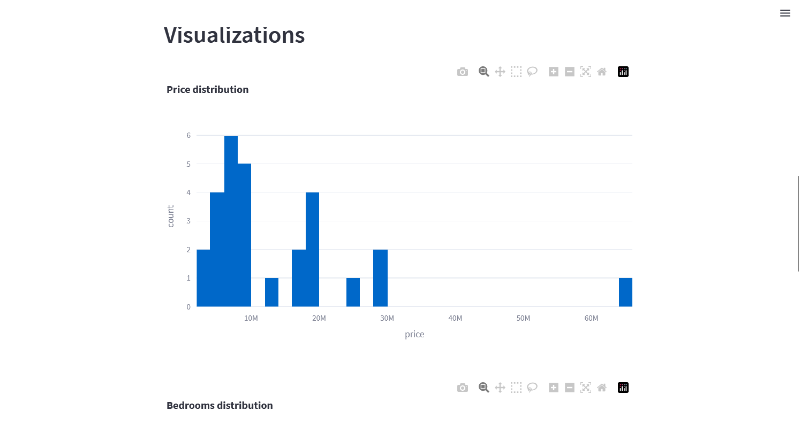

# Property Finder Data Dashboard 🏠

This application provides an interactive dashboard for real estate data collected from Property Finder through its API. The data is fetched in real-time based on a URL input by the user.

## Main Features 🌟
- **Key Performance Indicators (KPIs)**: The dashboard presents useful KPIs such as average price, most common number of bedrooms, most common number of bathrooms, most common broker, and average property size.
- **Visualizations**: The application provides visualizations of the data, including distributions of prices, number of bedrooms, number of bathrooms, and geographical locations of properties.
- **Ease of Use**: Simply input the Property Finder URL with your desired filters, and the dashboard will fetch and display the data automatically.

## How to Use the App 🛠️
1. Set up your filters on the Property Finder website, such as location, price range, and property type.
2. Copy the URL of the results page from your browser's address bar.
3. Open the Property Finder Data Dashboard application.
4. Paste the URL into the text input on the left sidebar and hit enter.
5. The application will fetch the data and display it in an easy-to-understand format.

## Installation and Setup 💻
To run the application locally, follow these steps:

1. Clone the repository: `git clone https://github.com/yourusername/yourrepository.git`
2. Navigate to the project folder: `cd yourrepository`
3. Create a virtual environment: `python -m venv venv`
4. Activate the virtual environment:
   - On Windows: `venv\Scripts\activate`
   - On macOS/Linux: `source venv/bin/activate`
5. Install the required packages: `pip install -r requirements.txt`
6. Run the application: `streamlit run app.py`
7. Open the displayed URL in your web browser.

## Contributing 🤝
Feel free to submit issues, feature requests, or pull requests! Your feedback and contributions are always welcome.
